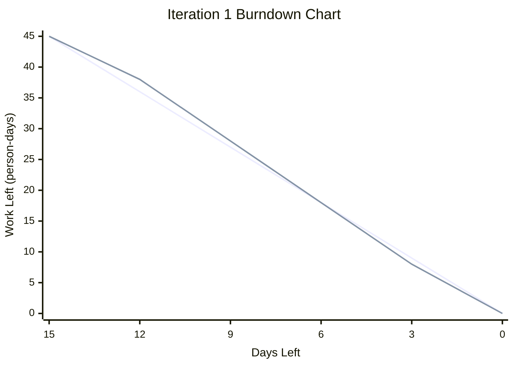

# Practical 6: Iteration 2 Planning and Adjustment

## 1. Actual Velocity of Iteration 1

The actual velocity of Iteration 1 is calculated by adding the effort of all completed Iteration 1 user stories.

| Completed User Story | Effort |
|---|---:|
| User Registration and Login | 10 days |
| Search Movies by Tags | 8 days |
| View Landing Page | 10 days |
| Browse Movie List | 12 days |
| Search Movies by Keyword | 5 days |
| **Actual Velocity** | **45 person-days** |

The actual velocity of Iteration 1 is **45 person-days** because all planned Iteration 1 user stories were completed.

### Team Capacity and Velocity Usage

Iteration 1 lasted for approximately 3 working weeks. Each team member had about 15 working days available during this iteration.

Since the team had 4 members, the total team capacity was calculated as:

```text
15 working days × 4 team members = 60 person-days
```

The team completed 45 person-days of work in Iteration 1. Therefore, the velocity usage rate was calculated as:

```text
45 / 60 = 0.75 = 75%
```

This means the team used about **75%** of its available capacity in Iteration 1.

| Item | Calculation | Result |
|---|---:|---:|
| Working days per member | 3 weeks × 5 working days | 15 days |
| Team capacity | 15 days × 4 members | 60 person-days |
| Completed effort | Sum of completed Iteration 1 user stories | 45 person-days |
| Velocity usage rate | 45 / 60 | 75% |

---

## 2. SRP and DRY Check

| Class / Component | SRP Check | DRY Check | Finding |
|---|---|---|---|
| User | Mostly satisfies SRP | Mostly satisfies DRY | The User class handles registration, login, profile update and preference tags. These functions are related to user account management. |
| Movie | Satisfies SRP | Satisfies DRY | The Movie class focuses on storing and managing movie information only. |
| Tag | Satisfies SRP | Satisfies DRY | The Tag class focuses on movie category and tag-based filtering. |
| Favourite | Satisfies SRP | Mostly satisfies DRY | The Favourite class handles saving and removing favourite movies. It should reuse user and movie validation logic. |
| RecommendationService | Needs improvement | Needs improvement | This service handles scoring, ranking and generating recommendations. It may become too complex, so the scoring logic could be separated later. |
| Administrator | Mostly satisfies SRP | Needs improvement | The Administrator class handles adding, updating and deleting movie information. Some validation logic may be repeated. |
| MovieCatalogService | Satisfies SRP | Mostly satisfies DRY | This service handles movie browsing, keyword search and tag search. Repeated search query logic should be reduced. |

Overall, most classes satisfy SRP because each class has a clear responsibility. However, `RecommendationService` may become too complex if all recommendation logic stays in one class. For DRY, repeated validation and database query logic should be refactored into reusable methods in future iterations.

---

## 3. Iteration 1 Burndown Rate Graph



| Days Left | Ideal Work Left | Actual Work Left |
|---:|---:|---:|
| 15 | 45 | 45 |
| 12 | 36 | 38 |
| 9 | 27 | 28 |
| 6 | 18 | 18 |
| 3 | 9 | 8 |
| 0 | 0 | 0 |

The burndown graph shows that the team started Iteration 1 with 45 person-days of planned work. The actual progress was slightly slower than the ideal line at the beginning, but the team caught up later and completed all planned work by the end of the iteration.

---

## 4. Updated Iteration 2 Backlog Based on Iteration 1 Velocity

The actual velocity from Iteration 1 was **45 person-days**. This velocity was used as a planning reference for reviewing the Iteration 2 backlog.

The Iteration 2 backlog contained three major user stories with a total estimated effort of **80 person-days**. This was higher than the Iteration 1 velocity, so the team split the large user stories into smaller sub-issues and monitored them using GitHub Project Board status labels.

By the end of Iteration 2, all three planned Iteration 2 user stories and all related sub-issues were completed.

| Iteration 2 User Story | Priority | Effort | Sub-Issues Completed | Final Status |
|---|---:|---:|---:|---|
| Automatic Movie Recommendation | 50 | 20 days | 8 / 8 | Done |
| Favourite Movies | 40 | 30 days | 9 / 9 | Done |
| Admin Add Movie Information | 40 | 30 days | 10 / 10 | Done |
| **Total** |  | **80 person-days** | **27 / 27** | **Completed** |

### Backlog Planning Reflection

Although the Iteration 2 backlog was larger than the Iteration 1 velocity, the team completed all planned Iteration 2 work. For future iterations, the team should continue using actual velocity as a planning reference and avoid overloading the backlog. Large user stories should be split into smaller tasks so progress can be monitored more clearly.

---

## 5. Monitoring Iteration 2 Tasks and User Stories

The team monitored Iteration 2 user stories and tasks using GitHub Project Board labels and status columns.

The following labels/statuses were used:

- Todo
- In Progress
- Done

By the end of Iteration 2, all Iteration 2 user stories and their sub-issues were moved to **Done**.

### Iteration 2 User Story Status

| User Story | Final Status |
|---|---|
| Automatic Movie Recommendation | Done |
| Favourite Movies | Done |
| Admin Add Movie Information | Done |

### Automatic Movie Recommendation Tasks

| Task | Estimate | Final Status |
|---|---:|---|
| Analyse Recommendation Requirements and Available Data | 2 days | Done |
| Prepare User Preference and Movie Tag Data | 3 days | Done |
| Design Hybrid Recommendation Algorithm | 4 days | Done |
| Implement Content-Based Recommendation Logic | 3 days | Done |
| Implement Collaborative Recommendation Logic | 3 days | Done |
| Combine and Rank Recommendation Results | 2 days | Done |
| Integrate Recommendations with User Interface | 2 days | Done |
| Test and Tune Recommendation Results | 1 day | Done |
| **Total** | **20 days** | **Completed** |

### Favourite Movies Tasks

| Task | Estimate | Final Status |
|---|---:|---|
| Design Favourite Movie Database Structure | 3 days | Done |
| Create Favourite Movie Database Table | 3 days | Done |
| Design Favourite Movie Button | 4 days | Done |
| Implement Add to Favourites | 4 days | Done |
| Implement Remove from Favourites | 4 days | Done |
| Develop Favourite Movies Page | 4 days | Done |
| Add Favourite Function Validation | 3 days | Done |
| Test Favourite Movie Functions | 3 days | Done |
| Fix Favourite Function Bugs | 2 days | Done |
| **Total** | **30 days** | **Completed** |

### Admin Add Movie Information Tasks

| Task | Estimate | Final Status |
|---|---:|---|
| Analyse Required Movie Information Fields | 2 days | Done |
| Design Admin Add-Movie Form | 4 days | Done |
| Create Movie Input Validation Rules | 3 days | Done |
| Implement Movie Poster Handling | 4 days | Done |
| Implement Add-Movie Backend Function | 5 days | Done |
| Implement Movie Database Insertion | 4 days | Done |
| Add Administrator Permission Checking | 3 days | Done |
| Display Add-Movie Result Messages | 2 days | Done |
| Test Add-Movie Function | 2 days | Done |
| Fix Add-Movie Bugs and Update Documentation | 1 day | Done |
| **Total** | **30 days** | **Completed** |

---

## 6. Completed vs Unfinished User Stories

### Iteration 1

| User Story | Effort | Status |
|---|---:|---|
| User Registration and Login | 10 days | Completed |
| Search Movies by Tags | 8 days | Completed |
| View Landing Page | 10 days | Completed |
| Browse Movie List | 12 days | Completed |
| Search Movies by Keyword | 5 days | Completed |
| **Total** | **45 days** | **All completed** |

### Iteration 2

| User Story | Effort | Status | Comment |
|---|---:|---|---|
| Automatic Movie Recommendation | 20 days | Completed | The hybrid recommendation feature was completed and connected to the user interface. |
| Favourite Movies | 30 days | Completed | Users can add, remove, and view favourite movies. |
| Admin Add Movie Information | 30 days | Completed | Administrators can add movie information with validation and result messages. |
| **Total** | **80 days** | **All completed** | No Iteration 2 user stories were left unfinished. |

---

## 7. GitHub Pages Update for Completed User Stories

GitHub Pages was updated to include completed user stories, implementation summaries, and evidence of completed features.

### Iteration 1 Completed User Stories

| Completed User Story | GitHub Pages Update |
|---|---|
| User Registration and Login | Added description and evidence for registration and login pages. |
| Search Movies by Tags | Added description and evidence for tag-based movie search. |
| View Landing Page | Added description and evidence for the landing page. |
| Browse Movie List | Added description and evidence for the movie list page. |
| Search Movies by Keyword | Added description and evidence for keyword search function. |

### Iteration 2 Completed User Stories

| Completed User Story | GitHub Pages Update |
|---|---|
| Automatic Movie Recommendation | Added description and evidence for the recommendation page, hybrid algorithm, and displayed recommendation results. |
| Favourite Movies | Added description and evidence for adding, removing, and viewing favourite movies. |
| Admin Add Movie Information | Added description and evidence for the admin add-movie form, validation, database insertion, and result messages. |
