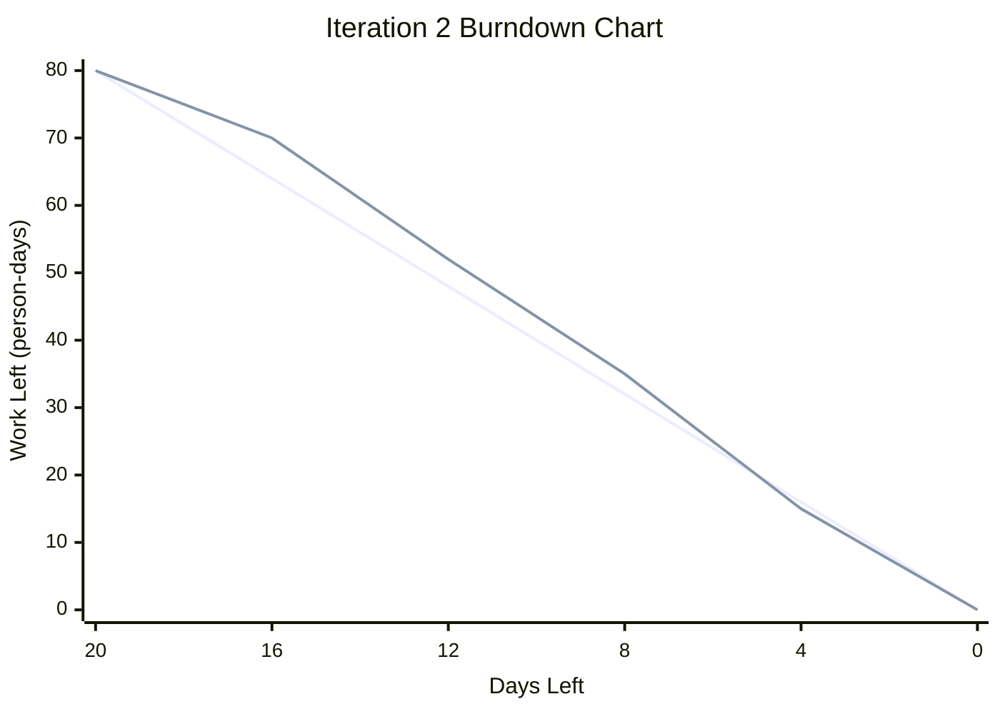

## 2.4 Iteration 2 Burndown Chart

The following data is used for the Iteration 2 burndown chart.

| Days Left | Ideal Work Left | Actual Work Left |
|---:|---:|---:|
| 20 | 80 | 80 |
| 16 | 64 | 70 |
| 12 | 48 | 52 |
| 8 | 32 | 35 |
| 4 | 16 | 15 |
| 0 | 0 | 0 |

The burndown chart shows that the team completed work slightly slower than the ideal plan at the beginning of Iteration 2. However, the team caught up near the end of the iteration and completed all planned work.
