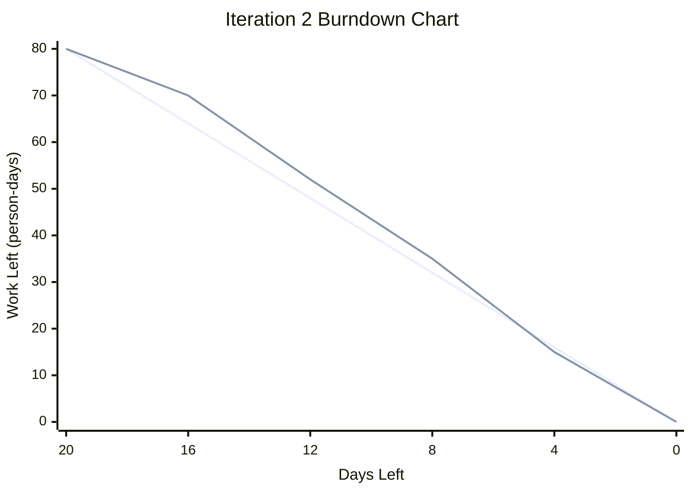

# Practical 8: Iteration 3 TDD and Mock Object Testing

## 1. Using UI Designs and User Stories as Test Specifications

The objective of Practical 8 is to continue the Hybrid Movie Recommendation System into Iteration 3 and practise Test-driven Development. In this practical, the team uses the current UI prototype together with Iteration 3 user stories as test specifications before continuing implementation.

According to Chapter 8, Test-driven Development means writing tests before writing the real production code. The test should fail first, then the developer writes the simplest code possible to make the test pass, and finally refactors the code if necessary. Therefore, the team follows the Red, Green, Refactor cycle during Iteration 3.

In this project, the UI designs and user stories are used together to define the expected system behaviour. The UI design shows what the user should be able to see and do, while the user story explains the function from the user’s point of view. By combining both, the team can write clearer test specifications before implementation.

---

## 1.1 Current UI Design Evidence

The current prototype of the Hybrid Movie Recommendation System includes the following UI screens:

| UI Screen | Description |
|---|---|
| Landing Page | The landing page shows the system title, course information, and a button that allows users to enter the home page. |
| Movie Home Page | The movie home page displays movie posters, movie titles, release years, and average ratings. It also includes navigation links and a search bar. |
| Movie Categories Page | The movie categories page displays different movie genres, such as Musical, War, Crime, Romance, Fantasy, Drama, Action, Comedy, Horror, Animation, and other types. |
| Popular Movies Page | The popular movies page displays highly rated or frequently rated movies, including movie posters, titles, years, and ratings. |
| User Login Page | The login page includes username and password input fields, a Remember Me option, and a Log In button. |
| User Registration Page | The registration page includes username, email, password, confirm password, and a Register button. |

These UI screens provide useful test specifications. For example, the login page shows that the system should accept a username and password, validate the input, and create a login session after successful login. The movie categories page shows that users should be able to select a genre and view movies that match the selected category. The movie home page shows that movie records should be retrieved from the database and displayed correctly.

Although the current UI prototype is still being improved, it is already useful for planning Iteration 3 tests. The team can use the existing UI structure as the basis for future admin update, admin delete, and user profile editing interfaces.

---

## 1.2 Iteration 3 User Stories for TDD

The Iteration 3 backlog includes three main user stories:

| Iteration 3 User Story | Priority | Effort | Status |
|---|---:|---:|---|
| Admin Delete Movie Information | 30 | 10 days | Todo |
| Admin Update Movie Information | 40 | 25 days | Todo |
| Edit User Personal Information | 30 | 15 days | Todo |

These user stories are used as the starting point for the TDD process. Before implementing each function, the team writes test specifications based on the user story, related UI design, and acceptance criteria.

---

## 1.3 UI-based Test Specifications for Iteration 3

| Iteration 3 User Story | UI Design Requirement | Test Specification |
|---|---|---|
| Admin Delete Movie Information | The administrator should be able to find and select a movie record. The interface should clearly show the movie title and related information. A delete button and confirmation message should be provided before deletion. | Test that an authenticated administrator can delete an existing movie. After deletion, the movie should no longer appear in the movie list, search results, category results, or recommendation results. Invalid movie IDs and unauthorised users should be rejected. |
| Admin Update Movie Information | The administrator should be able to select an existing movie and open an editing form. The form should display the existing movie information, such as title, description, director, writer, actors, genre, duration, and release date. | Test that the correct movie information can be retrieved and displayed in the editing form. Test that valid changes can be saved successfully. Test that empty required fields, invalid duration, invalid release date, and unauthorised update attempts are rejected. |
| Edit User Personal Information | A logged-in user should be able to open a profile editing page and update username, email, password, and preference tags. The page should show the current user’s existing information before editing. | Test that a logged-in user can update only their own personal information. Test that updated information is saved correctly. Test that invalid email format, empty required fields, duplicate account information, and attempts to edit another user’s information are rejected. |

---

## 1.4 TDD Process Used in Iteration 3

The team follows the Test-driven Development process below:

1. Select an Iteration 3 user story.
2. Review the UI design and acceptance criteria.
3. Write a test specification based on expected user behaviour.
4. Write an automated test before or during implementation.
5. Run the test and confirm that it fails if the function is not implemented yet.
6. Implement the simplest code needed to pass the test.
7. Run the test again and confirm that it passes.
8. Refactor the code if needed.
9. Update the related GitHub issue label from Todo to In Progress and then to Done after completion.
10. Update GitHub Pages for the completed user story.

This process follows the Red, Green, Refactor cycle. In the Red stage, the test fails because the function is not complete yet. In the Green stage, the developer writes the simplest working code to pass the test. In the Refactor stage, the developer improves the code structure while keeping the test passing.

---

## 1.5 Application of TDD to the Movie Recommendation System

For the Hybrid Movie Recommendation System, TDD helps the team connect user stories, UI expectations, and implementation. Instead of writing code first and testing later, the team defines the expected behaviour before implementation.

For example, the login UI shows that a user must enter a username and password before accessing personalised functions. Therefore, a related test should check whether the system creates a valid user session after successful login. The movie category UI shows that users should be able to browse movies by genre, so the related test should check whether selecting a genre returns the correct movies.

For Iteration 3, the same idea will be applied to administrator and profile management features. The team will first define tests for deleting movie information, updating movie information, and editing user personal information. These tests will guide the implementation and help confirm that each function works as expected.

Using TDD also helps reduce unnecessary code. The team only implements code that is required to pass the current test. After the test passes, the team can refactor the code to improve readability, reduce duplication, and improve maintainability.
---

## 2. Reflection on Iteration 2 and Adjustment for Iteration 3

## 2.1 Iteration 2 Reflection

In Iteration 2, the team focused on three main user stories: Admin Add Movie Information, Favourite Movies, and Automatic Movie Recommendation.

Although the backlog document still shows the parent user stories as Todo, the related sub-issues were completed. Admin Add Movie Information had 10 of 10 issues completed, Favourite Movies had 9 of 9 issues completed, and Automatic Movie Recommendation had 8 of 8 issues completed. Therefore, the team treats all three Iteration 2 user stories as completed.

Overall, Iteration 2 was successful because the team completed the planned work and improved the movie recommendation system by adding administrator movie management planning, favourite movie functionality, and automatic recommendation functionality.

However, the team also found one project management issue. Some parent user stories were not updated to Done even though all related sub-issues were completed. This may cause confusion when checking progress, calculating velocity, or preparing practical documents. In Iteration 3, the team should update both parent user stories and sub-issues consistently.

## 2.2 Completed and Unfinished User Stories in Iteration 2

| Iteration 2 User Story | Effort | Final Status | Comment |
|---|---:|---|---|
| Admin Add Movie Information | 30 days | Completed | All 10 related sub-issues were completed. |
| Favourite Movies | 30 days | Completed | All 9 related sub-issues were completed. |
| Automatic Movie Recommendation | 20 days | Completed | All 8 related sub-issues were completed. |

There were no unfinished user stories in Iteration 2.

## 2.3 Actual Velocity of Iteration 2

The actual velocity of Iteration 2 is calculated by adding the effort of all completed user stories.

| Completed User Story | Effort |
|---|---:|
| Admin Add Movie Information | 30 days |
| Favourite Movies | 30 days |
| Automatic Movie Recommendation | 20 days |
| **Actual Velocity** | **80 person-days** |

The actual velocity of Iteration 2 is **80 person-days** because all planned Iteration 2 user stories were completed.

## 2.4 Iteration 2 Burndown Chart

The following data is used for the Iteration 2 burndown chart.

| Days Left | Ideal Work Left | Actual Work Left |
|---:|---:|---:|
| 15 | 80 | 80 |
| 12 | 64 | 70 |
| 9 | 48 | 52 |
| 6 | 32 | 35 |
| 3 | 16 | 15 |
| 0 | 0 | 0 |



The burndown chart shows that the team completed work slightly slower than the ideal plan at the beginning of Iteration 2. However, the team caught up near the end of the iteration and completed all planned work.

## 2.5 Adjusted Plan for Iteration 3

The actual velocity of Iteration 2 was 80 person-days. Based on this velocity, the team updated the Iteration 3 backlog.

The Iteration 3 backlog includes three user stories:

| Iteration 3 User Story | Priority | Effort | Status |
|---|---:|---:|---|
| Admin Delete Movie Information | 30 | 10 days | Todo |
| Admin Update Movie Information | 40 | 25 days | Todo |
| Edit User Personal Information | 30 | 15 days | Todo |
| **Total Planned Effort** |  | **50 days** |  |

The total planned effort for Iteration 3 is **50 person-days**. This is lower than the Iteration 2 actual velocity of 80 person-days, so the Iteration 3 backlog is realistic and achievable.

The team intentionally planned less work for Iteration 3 because the new tasks involve administrator permission checking, validation, data update, data deletion, and user profile editing. These features require careful testing to avoid deleting or changing incorrect data.

## 2.6 Monitoring Plan for Iteration 3

The team will continue using GitHub Project Board labels and status columns to monitor Iteration 3 user stories and tasks.

The following labels/statuses will be used:

- Todo
- In Progress
- Done

Each Iteration 3 user story will be broken into smaller tasks. When a task is started, it will be moved from Todo to In Progress. When the task is completed and checked, it will be moved to Done.

## 2.7 GitHub Pages Update Plan

For each completed Iteration 3 user story, the team will update GitHub Pages with a short description, implementation status, and evidence of completion.

| Iteration 3 User Story | GitHub Pages Update Plan |
|---|---|
| Admin Delete Movie Information | Add description and evidence for deleting movie information. |
| Admin Update Movie Information | Add description and evidence for updating movie information. |
| Edit User Personal Information | Add description and evidence for editing user account information and preference tags. |

---

## 3. Mock Object Framework Research

## 3.1 What is a Mock Object?

A mock object is a simulated object used in software testing. It works as a replacement for a real object during a test. Instead of using the real object, the test uses a mock object to control the expected behaviour.

In Test-driven Development, mock objects are useful because they allow the team to test one part of the system without depending on another part that may be incomplete, slow, or difficult to control. For example, a system may normally need to connect to a database, check a user session, or call another service. During testing, a mock object can simulate these behaviours.

In Chapter 8, mock objects are introduced as object stand-ins. They help reduce dependency on real classes and make it easier to test code independently. This supports the TDD idea of writing focused tests and implementing the simplest code needed to pass the tests.

## 3.2 Why Mock Objects Are Useful

Mock objects are useful for this project because the movie recommendation system includes functions that depend on user login, database records, and recommendation logic.

For example, the recommendation page requires a logged-in user. If the user is not logged in, personalised recommendation cannot work correctly. Instead of repeating the full login process in every test, a mock object can simulate a successful login process.

Mock objects can help the team:

- Test one function without relying on the full system.
- Simulate user login behaviour.
- Avoid unnecessary database dependency in some tests.
- Control expected test conditions.
- Make testing faster and more focused.
- Support the Red, Green, Refactor TDD process.

## 3.3 Mock Object Framework Used

In this Django project, the team uses Python's built-in mock object framework:

```python
from unittest.mock import Mock, patch
```

`Mock` is used to create a fake object.  
`patch` is used to temporarily replace a real object or method during a test.

For Practical 8, the team creates a mock object to simulate a successful user login process. The real database query used in the login view is replaced by a mock query result. This allows the test to check whether the login view stores the user ID in the session correctly.

## 3.4 Mock Login Test Specification

| Test Item | Description |
|---|---|
| Test Name | Mock user login process |
| Related Function | User login |
| Related UI | User Login Page |
| Input | Username and password |
| Mock Object | A mock user object with a valid user ID |
| Expected Result | The system redirects the user and stores the user ID in the session |
| Purpose | To simulate successful login without relying fully on the real user query process |

This mock test is connected to the existing login page. The login UI contains username and password fields, a Remember Me option, and a Log In button. Therefore, the test checks whether the system can process valid login data and create a login session.

## 3.5 Mock Login Test Implementation

The mock login test is implemented in a new test file:

```text
movie/test_practical8_mock.py
```

This file is added separately from the existing `movie/tests.py` file. The existing `tests.py` file already contains the Practical 7 automated tests, so it should not be replaced.

The mock test simulates the user lookup process in the login view. When the login view calls the user query, the mock object returns a fake valid user. The test then checks that the response redirects successfully and that the user ID is stored in the session.

The test can be run with the normal Django test command:

```bash
python manage.py test movie --settings=Movie_recommendation_system.test_settings
```

After adding this mock test, the expected result is:

```text
Ran 16 tests
OK
```

This means the original 15 Practical 7 automated tests and the new Practical 8 mock object test all passed.

---

## 4. Summary

Practical 8 continues the Agile iteration process from Iteration 2 to Iteration 3. The team completed Iteration 2 with an actual velocity of **80 person-days** and used this velocity to plan a realistic Iteration 3 backlog of **50 person-days**.

The current UI prototype is used as the basis for TDD test specifications. The team also researched mock object testing and implemented a mock login test to simulate the login process. This supports the Practical 8 requirement to try mock objects in project testing.

